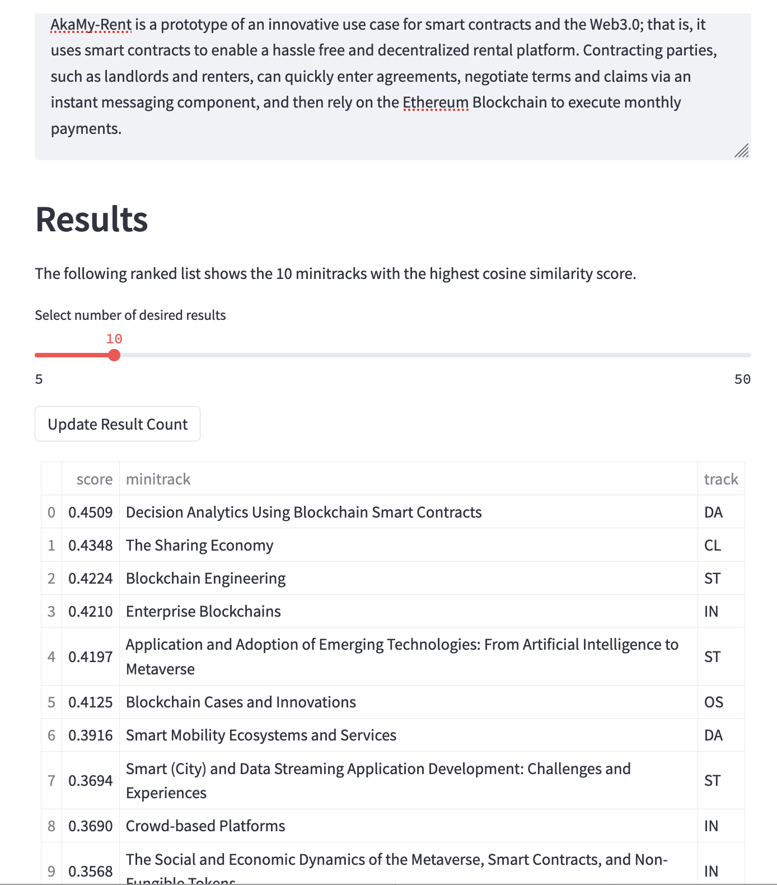

AkaMy-Rent is a blockchain and smart contract based rental agreement platform that our team worked on during our ICS 613 course. While you may find out more about the current status of the project and my role in the project in [this project report](../projects/akamy-rent.md), and our [project website](https://akamy-rent.github.io), this article discusses the project's potential for being published / presented at a conference. 

## Publication Venue
Working for an academic conference, the Hawaii International Conference on System Sciences (HICSS), for the past years, I'm heavily biased towards finding a suitable publication venue within the HICSS landscape. Coincidentally, I've worked on a minitrack recommendation system this semester that takes in an abstract, performs a semantic search in a corpus of all current minitrack descriptions, and outputs a ranked list of minitracks that the abstract is most similar to based on the cosine similarity measure between the embeddings of abstract and minitrack descriptions. Using this semantic search application and the introduction text from [the AkaMy project](../projects/akamy-rent.md), I received the following list of minitrack recommendations:

Further reading into the descriptions of some of the minitracks listed, they do seem like good fits depending on the direction that one would want to take this project. That is, if the focus is more on the software engineering aspects of the prototype architecture and tooling, then the minitrack listings from the [Software Technology (ST)](https://hicss.hawaii.edu/tracks-56/software-technology/) track could be good options. If the focus is however more on the user experience, new domain opportunities and business models for entering decentralized contracts without a trusted third party, than some of the minitracks in the [Internet and the Digital Economy (IN)](https://hicss.hawaii.edu/tracks-56/internet-and-the-digital-economy/) track could be more fitting.

## Future Work
Knowing that there are good publication venues at one of the leading Information System conferences, it's worth discussing three areas where I see potential for future work: a) concept development for how to best utilize smart contracts acclaimed benefits, b) constructing a full testbed with a cloud-based simulated blockchain, and c) refactoring and extending the codebase of the current web application.

### Concept work 
The current utilization of smart contracts on the AkaMy-Rent platform is very basic and does not offer any obvious benefits over traditional agreements that use credit cards for payment. Smart contract are praised for their capabilities to program business rules "into" the contract that then get deployed to the blockchain and executed when conditions are met. In the rental application space, it'd be interesting to see how this can become relevant with respect to encoding terms and conditions of the agreement into the contract such that renters have more leverage over landlords for following through on their responsibilities, and that landlords are more protected from flaky tenants that damage and/or abandon apartments. More domain knowledge in the rental industry would be helpful in this work. 

Conceptual work should also be put into answering some of the more obvious questions that arise when applying over-hyped technologies such as smart contracts:

* Can the same functionalities also be achieved faster, cheaper, more reliably with traditional approaches?
* Are user data protected and can such services be aligned with common user protection laws, such as GDPR, that set strict requirements on the ability to delete all user-associated data?
* Are there ethical concerns when such decentralized systems are misused. How can one detect and handle misuse of the platform?

### Testbed development
The current simulated blockchain only works locally in development and requires quite a bit of technical knowledge to setup and run. To really do some user testing with this application, the project would require a cloud-based simulated blockchain, so that users can test AkyMy-Rent with virtual money, instead of actual money on the Ethereum blockchain. Ideally, if one could construct a docker based private ethereum network, once could work with it easily both locally and in a cloud deployment. 

### Software Engineering Aspects
Due to time limitations, this project being a learning experience in web application development for everyone, and the desire to get a first proof of concept working, some inconsistent and limiting design decisions were made, especially at the DB modeling level. The envisioned use case for this project was that of a subletting for college students, which would require more than just two parties involved in a contract. The current schema only includes fields for a homeowner and a single tenant, thus making it difficult to implement the envisioned use case. The current implementation is furthermore heavily denormalized, which will make data updates, such as profile changes, very tedious in the future. These shortcomings in the proof of concept are however easy to correct for if one was to continue working on this project.
