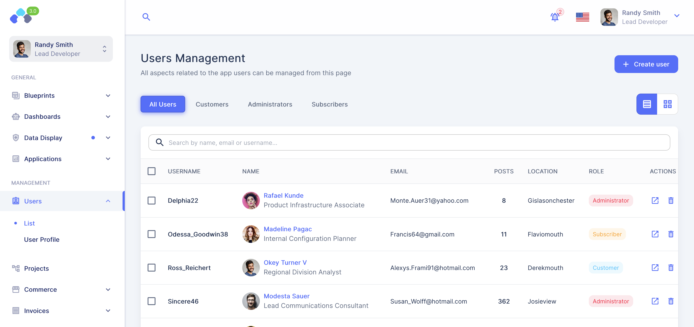
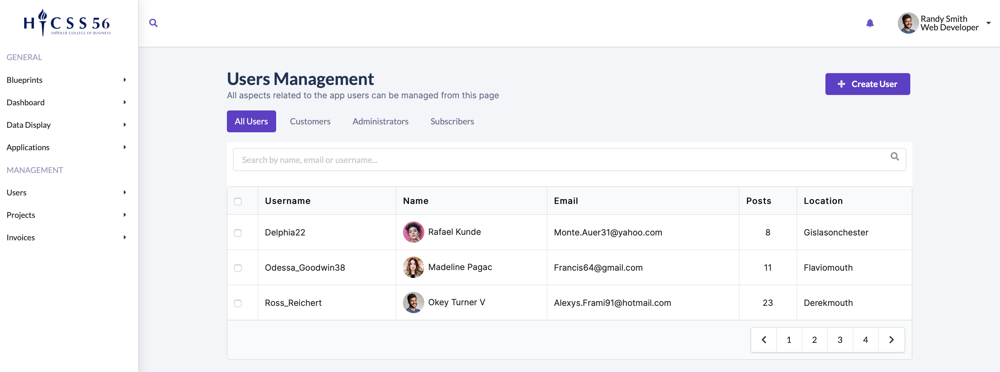

## I'm not a frontend person

Out of the various responsibilities of a Fullstack Engineer, I would say have the least experience and knowledge of frontend development. While usability and design are very important to me, I tend to prefer backend over frontend tasks. Part of the reason for this is that I feel less efficient when working on frontend tasks. I tend to adjust and get stuck on minor details and easily spend an hour or two without making any significant progress. In fact, the practice WOD activities from the recent weeks confirm this feeling (see WOD times at the bottom of the page). As a result, I haven't found the motivation to put in the time to really get comfortable and fluent in any of the major UI component libraries / utility frameworks. I've worked with a variety of them, including Bootstrap, Material-UI, and Tailwind CSS, but only to the minimum extend necessary. 

## My experience with UI frameworks
For example, when I started developing the [HICSS CMS](../projects/hicss-cms) from scratch, I simply look for templates on the [creative-tim.com](https://www.creative-tim.com/product/paper-kit-2) website and picked a template that used the Bootstrap framework. Given that I like frontend tasks the least, I decided to use a template that included enough examples closely related to what I was going to use.

Through another project, I was introduced to Material-UI ([MUI](https://mui.com/)) in React, which I actually enjoyed quite a bit. The default styling of the components of the MUI library are quite nice and the documentation is great, making it really enjoyable to work with. 

I've also played around with [Tailwind CSS](https://tailwindcss.com) and some of the components of the Tailwind UI library, which is just a collection of components implemented with Tailwind CSS. Tailwind CSS differentiates itself by being less template-y and very customizable without having to write actual CSS code. 

## Adding Semantic UI to my list of options

Having spent about a week now with [Semantic UI](https://semantic-ui.com), it feels more or less the same as using another component library like Bootstrap or Material-UI. It's difference mainly lies within the naming of classes, which are a bit more natural. Otherwise the workflow seems to be about the same: read the documentation on a component and its variations, and then adapt an example to match the desired design.

During one of the WOD activities, I tried to implement a template for a [MUI Admin Dashboard](https://tokyo.bloomui.com/accent-sidebar/management/users/list) using Semantic UI. It easily took me over 3 hours to come to a satisfactory result with about 80% of the time spend on figuring out and styling the dashboard layout with a fixed [sidebar](https://semantic-ui.com/modules/sidebar.html) on the left and a shifted top menu that is offset, but not pushed over. With the help of the documentation, various stack overflow comments, and this [codepen](https://codepen.io/roham96/pen/JjoVxmX), I put together a layout (right image below) that has some resemblance to the original template (left image below).

    

        
    

    

        
    

## Which framework should I choose?

As I'm in the process of recreating aspects of the [HICSS CMS](../projects/hicss-cms), I have now to decide which framework to use. While I'm familiar with Material-UI in React Applications, a final decision between Material-UI and Semantic UI will be made once I've worked a bit more with Semantic UI in React. Looking through the Material UI documentation however for the [Data Grid](https://mui.com/components/data-grid/demo/) and the [Component Styling](https://mui.com/system/basics/) as research for this article, I'm leaning towards Material-UI for its richer feature set and capabilities. Especially the Data Grid looks like a great match for my application, which is heavily based on tabulated data that some users would also like to print/export. That said, I'm looking forward to getting my feet wet using Semantic UI with React.

## WOD Times

**Browser History Wod Times**:
- WOD Time: 18:30
- WOD Time CSS-1: 19:00
- WOD Time Column-1: 13:00
- WOD Time Semantic UI: 14:35

**Island Snow**
- WOD 1: 28 min
- WOD 2: 20 min
- WOD 3: 8 min

**Your Choice**
- over 3 hours
