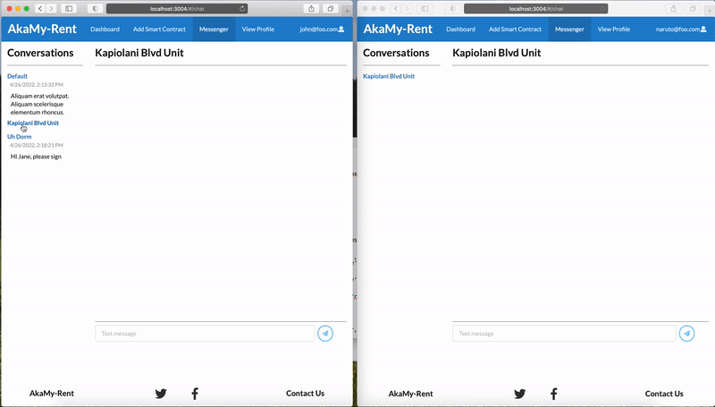

AkaMy-Rent is a prototype of an innovative use case for smart contracts and the Web3.0; that is, it uses smart contracts to enable a hassle free and decentralized rental platform. Contracting parties, such as landlords and renters, can quickly enter agreements, negotiate terms and claims via an instant messaging component, and then rely on the Ethereum Blockchain to execute monthly payments. 

The application was prototyped using the [Meteor Framework](https://www.meteor.com) and a [ReactJS frontend](https://reactjs.org) and the [Semantic-UI design framework](https://react.semantic-ui.com). Although not configured to be used with the Ethereum blockchain in production, the [Genache simulated blockchain](https://trufflesuite.com/ganache/) can be used during and for development and interacted with using the [Ether.js library](https://docs.ethers.io/v5/).

My role in the project was the implementation of the messenger component illustrated below, and general support in the team with regards to technical implementation details and component structuring/re-utilization. The messenger component implementation was an interesting use case because it allowed me to purposely define a denormalized database schema. Said schema uses a single document to store both message group members and messages themselves in buckets within the single document, rather than in a more normalized fashion with a 1:M relationship between group and message entities and a M:N bridge relation connecting users and groups. For this prototype system, the single document implementation worked fine, although I couldn't help but wonder how well it could scale at production scale. It was further frustrating that while MongoDB allows sorting of arrays on insert of array elements using the `$set` operator, Minimongo cannot handle it because `"$sort requires $slice to be present"`, as explained in [this smart question on the Meteor forum](https://forums.meteor.com/t/push-and-sort-a-couple-separated-by-slice/13699). 

To learn more about my teams members, the project, and view the source code, visit our [project page](https://akamy-rent.github.io). 
